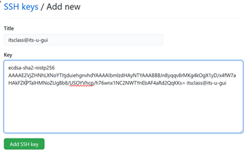

### Task 3 - Connecting to Github with SSH Key based auth

NOTE!!! - Github has a tool for forming a session based authentication that is compatible with both SSH Key and HTTP.  It is recommended to use that guide instead <https://github.com/OHIO-ECT/ECT-Git-Tutorial-1/blob/main/GitHub-Auth.md>

1. IF you have an existing Github account - Add your student Ohio University email address to the Emails section of the Account settings.

    
     

2. ELSE Make your own Github account using your Ohio University email address.

3. Setup SSH key based authentication to allow the itsclass user to connect to GitHub. Create the user key by issuing the following command on the linux system with the local repo. When prompted use the default file location and use a memorable passphrase for this
    key.
    ````
    ssh-keygen -t ecdsa
    ````
4. Use the following command to retrieve the public side of the new key that was generated.
    ````
    cat ~/.ssh/id_ecdsa.pub
    ````
5. Copy the output and paste it to a new entry on GitHub under "SSH and GPG Keys" section of "Settings". You should receive an email from Github stating that a new SSH key was added to your account.

    
    

6. Since the git command is making an SSH connection the user is prompted to accept the SSH finger print the first time. The local Ubuntu OS will prompt for the SSH password before allowing access to the private key on the VM. (Security is VERY secure.... Sigh). You may have to run the last command a second time if it fails while opening the local key store.

7. **[Optional]** **For SSH session users:** Tired of entering the local SSH passphrase all of the time? Run the following series of commands. These will have to re-run if the user restarts or opens a new terminal.
    ````
    eval $(ssh-agent)

    ssh-add
    ````