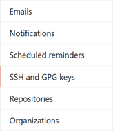
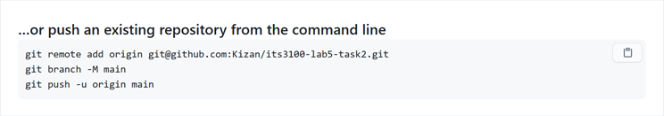
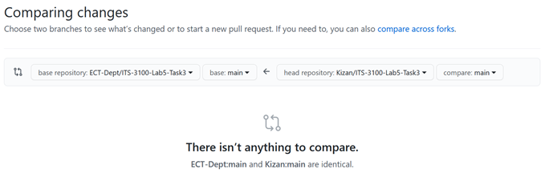

### Task 3 - Connecting to Github with SSH Key based auth

22. IF you have an existing Github account - Add your student Ohio University email address to the Emails section of the Account settings.

    
     

23. ELSE Make your own Github account using your Ohio University email address.

24. Setup SSH key based authentication to allow the itsclass user to connect to GitHub. Create the user key by issuing the following command on the linux system with the local repo. When prompted use the default file location and use a memorable passphrase for this
    key.
    ````
    ssh-keygen -t ecdsa
    ````
25. Use the following command to retrieve the public side of the new key that was generated.
    ````
    cat ~/.ssh/id_ecdsa.pub
    ````
26. Copy the output and paste it to a new entry on GitHub under "SSH and GPG Keys" section of "Settings". You should receive an email from Github stating that a new SSH key was added to your account.

    
    

27. Click on your account name to return to the main dashboard screen. Using the + icon next to your picture in the upper right corner (not the big picture!) create an New repository in [Github] called ect-git-tutorial-1. Accept the defaults on the new repository creation screen.

28. After creation GitHub gives a series of recommendations for connecting the existing repository on the student VM to the new ect-git-tutorial-1 (empty) repository on GitHub. On the
post-creation screen **[make sure to use the SSH based URLs]** and authentication. Poke the SSH button at the top to change from HTTP to SSH command sets.

    

29. Use the commands at the bottom from the "...or push an existing repository from the command line" to the local repository. See example below:

    

30. Since the git command is making an SSH connection the user is prompted to accept the SSH finger print the first time. The local Ubuntu OS will prompt for the SSH password before allowing access to the private key on the VM. (Security is VERY secure.... Sigh). You may have to run the last command a second time if it fails while opening the local key store.

36. **[Optional]** **For SSH session users:** Tired of entering the local SSH passphrase all of the time? Run the following series of commands. These will have to re-run if the user restarts or opens a new terminal.
    ````
    eval $(ssh-agent)

    ssh-add
    ````


31. Return to GitHub and look at the README.md file in the respostory. **Hint: Changes should be there.**

32. Make another change to the README.md file and commit the change to the local repository.

33. Run git status and note the additional information about synchronization between the local "branch" and the remote "branch" of the repository.

34. Run the following command to push the content to the remote branch.
    ````
    git push
    ````
35. Then run git status to check that all of the changes were applied.


37. Return to Github and browse to the README.md file. Use the Edit "pencil" icon to add a comment to the file via the web page.

38. Return to the command prompt and run git status. Notice that it still identifies the repo as being in sync.

39. Also note that git is recommending the next step.
    ````
    git pull
    ````

### Summary

-   `git add <filename>` - stage the edit (aka needs to be include in
    index)

-   `git commit` - move change from staging to the local index

-   `git push` - move the changes to the local index to remote repo

-   `git pull` - to bring remote changes directly to the working files

### Task 4 - Collaboration

RDRTC is starting a new project to implement a content management system into their website. This is going to require Sally to collaborate with an external consultant. The consultants have already setup a different Git repository for this project and pushed the existing files to it. Sally wants to work with her OWN version of the file. So she will "fork"
the consultants repo to one of her own. This will allow her to commit/push/pull to a copy of her own work on GitHub.

40. Go to <https://github.com/ECT-Dept/ect-git-tutorial-2> in the upper right corner select the fork option. This will create a copy of the repo into your GitHub account as it's own standalone repo.

    

41. Once forked (yes, that's a real word... sorta) the new copy of the repo will show up on your GitHub dashboard. Note at the top of the repo it shows the status of your fork compared to the parent.

    

42. The compare button will show status of any differences (should they exist).

    

43. Make a new project directory for Task 3 on your Virtual Machine, but do NOT initialize the git repo.
    ````
    mkdir -p ~/ect-git-tutorial-2

    cd ~/ect-git-tutorial-2
    ````
44. It is much more common to start from an existing project. The SSH link needed on the git clone command its obtained GitHub dash for the repo. Click on the "Code" button making sure to select SSH in the sub-dialog box.
    
    

45. The following git command creates a "local" copy of the "remote" repository. **Note the . at the end of the command!**
    ````
    git clone <link to your fork of the repo> .
    ````
    **[Pro Tip]** Leaving the . off the end of the git clone caused git to create a new directory with the name of the repository and put the files from the repo in that directory.

46. View the files that are included in the repository with the following linux command. This time the argument is a * (representing any visible files or directories) instead of a . to
    avoid listing the hidden git files.
    ````
    find *
    ````
47. Edit the index.html with nano then commit and push changes to GitHub.

48. Go back and examine the compare function discussed earlier.

This forked repository allows the user to make their own updates to the files in the repository and also store them on Git. It is possible, but outside of the scope of this guide to incorporate (pull) changes between the two forks. For example if the original repository is updated or if a change is made in the forked copy that is desirable to be incorporated
into the main project.

### Deliverables

If this Git tutorial is being used as a class assignment. Submit the following information for credit.

1.  Output of `find .` for the ect-git-tutorial-1 project directory.

2.  Output of `git log` for the ect-git-tutorial-1 local git repository.

3.  Output of `find .` for the ect-git-tutorial-2 project directory.

4.  Output of `git log` for the ect-git-tutorial-2 local git repository.

5.  Screen shot of the task 3 project showing the GitHub Repository page. (Not with a cell phone cam with the screenshot function of the PC!)

### Glossary

a.  Repository

b.  Working Tree (Directory)

c.  Index

d.  Commit - changed files put into local repo

e.  branch

f.  head

g.  clone - pull all remote file(s) from a repository to a folder on local machine

h.  push - changed repo pushed to network repo

i.  pull - resync any changes from the network repo to local repo
