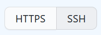
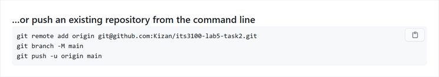
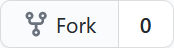
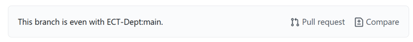
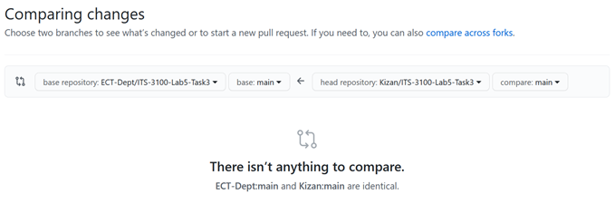
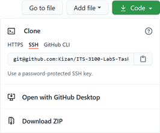

# ECT Git Tutorial 1

### Goals 

-   Gain experience with Git and GitHub

### Toolkit 

-   A personal computer, referred to as PC for the remainder of this document.

-   Git Intro Videos: <https://git-scm.com/videos>

-   Git reference material: <http://alice.library.ohio.edu/record=b5724750~S7>

-   Network Programmability and Automation: Skills for the Next-Generation Network Engineer, Chapter 7 by Jason Edelman. Available digitally on O'Reilly via OU Library at <http://alice.library.ohio.edu:80/record=b5695171~S7> . Ask if assistance is needed for seeting up an account at O'Reilly.

### Ducky wisdom

 **[IMPORTANT]** - Some of the processes in this lab are multiple steps. Students must read through the lab once before running any of the commands to ensure that all of the processes are completed correctly. Ducky recommends this process for all future labs and homeworks in this class and others.

 **[Pro Tip]** - Start a lab notebook (likely digital) to store useful cli commands for systems like linux, vyos, git, etc.

 **[Pro Tip]** - O'Reilly books publishes a lot of content that is applicable to work in Information Technology. The books that O'Reilly produces are not "light reading", but will serve as a solid reliable reference material. On the topic of Git, there is a book "Version Control with Git" that is available digitally at Safari books which Ohio University students can access via Library website. <http://alice.library.ohio.edu/record=b5724750~S7>

 **[IMPORTANT]** - Due to fast evolutions of software and other technology, a reader needs to be cautions with program documentation and suggested practices found in books and on the Internet. Material should be checked against the system's manufactures current documentation or otherwise questioned to test if the information is applicable to current software and to the business practices of the group the software is being applied to. This type of analysis is important for successful IT projects and when done well is a mark of a good Information Technologist.

 **[IMPORTANT]** - This lab leverages a small fraction of Git's functionality, representing the most common functions that a Git user will need to navigate simple code and configuration projects.

### Task 1 - Install Tools

1. If this Tutorial is being used for an ECT/ITS class, refere to notes in the Blackboard assignment for information on what environment to complete this work in.

2. This tutorial assumes that the user is completing this work in a terminal window in a Desktop Ubuntu computer system. This system will be referred to as "VM" for the remainder of this tutorial.

3. Run the following command to install the git system if it is not already done so.
    ```
    sudo apt install -y git
    ````

4. (OPTIONAL) Download the Git client for your OS: <https://git-scm.com/downloads> The course administrators recommend **NOT** installing the GUI tools.

### Task 2 - A simple local repo

The Rubber Ducky Rubber Tire Company (RDRTC) starts off as a small company with the owners youngest child, Sally Ducky, designing the website. To make it easier to keep track of the changes to the site, she creates a local git repository to keep track of changes to the site.

5. Make a new "project directory". Use good "file hygiene", Don't throw everything in the user home directory or "My Documents". The Linux "mkdir" command is responsible for making directories in the shell environment.
    ````
    mkdir ~/ect-git-tutorial-1
    ````
6. Change the current working directory to this project to simplify future commands.
    ````
    cd ~/ect-git-tutorial-1
    ````
7. Run the following command to show the contents of the working directory. In most unix shells files and directories that start with a . are considered "hidden". The -al flags to the ls application instruct that application to show the hidden directories and additional details.
    ````
    ls -al
    ````
8. Run the following command to create (initialize -- init) an empty git repository. The current directory will forever be known as the "working tree" or "working directory" for this git project.
    ````
    git init
    ````
9. Run the following command to show the contents of the current directory. Notice that the directory is not empty now, and .git directory contains the "index" for the git project.
    ````
    ls -al
    ````
10. **[Data]** The .git directory is the un the following command to show all of the file that exist under the current working directory including the files that make use the git index. 

    **[WARNING]** Editing the files in the git index directory is very hazardous to the  stability of the repositiory, and work can be lost.
    ````
    find .
    ````
11. **[Pro Tip]** To change the default editor to Nano. Just in case VIM isn't to your liking.
    ````
    git config --global core.editor "nano"
    ````
12. Use your favorite editor to create a file in the project directory. **Yes please use this file name, it will matter later.**
    ````
    nano README.md
    ````
13. Documentation is critical to any IT systems, networks, software, etc. Add some text to this file that will help future readers understand what this project is for. Save the document and return to the command line.

14. Make git aware of this new file by "adding" it to the git index.
    ````
    git add README.md
    ````
15. Commit this addition to the git repo with the commit command. Note the error message and move on to the next instruction.
    ````
    git commit -m "Test Comment"
    ````
16. Git often has helpful commands that the software recommends running next. On accounts that have not used Git before, the system requires editing the git configuration to include the users name and email address. Follow the instructions configure the user information.

17. Re-run the git commit command. Git demands a comment to be included in the commit in the form an nano editor window. Add some simple text describing the action being taken, write the file and exit the editor to complete the commit.

18. Edit the README.md and add an additional text.

19. There are now two copies of the README.md file on the local system. One in the working tree which is visible to the user and one in the index which is not. It is important to keep these two file insync with each other. The following git command will show the status of the two copies.
    ````
    git status
    ````
20. Repeat the git add README.md and then git commit commands sequence.

21. Run the following command to show more information about the status of the repository including information on the last change made.
    ````
    git status
    ````
### Task 3 - Connecting to Github

Sally is planning to move the RDRTC website to a new set of servers soon. She needs to keep a copy of the files on her local PC. Sally chose Github for source control services. This will allow her to not only track changes, but "push" these changes into the Github and easily "pull" to other systems.

22. IF you have an existing Github account - Add your student Ohio University email address to the Emails section of the Account settings.

    
     

23. ELSE Make your own Github account using your Ohio University email address.

24. Setup SSH key based authentication to allow the itsclass user to connect to GitHub. Create the user key by issuing the following command on the linux system with the local repo. When prompted use the default file location and use a memorable passphrase for this
    key.
    ````
    ssh-keygen -t ecdsa
    ````
25. Use the following command to retrieve the public side of the new key that was generated.
    ````
    cat ~/.ssh/id_ecdsa.pub
    ````
26. Copy the output and paste it to a new entry on GitHub under "SSH and GPG Keys" section of "Settings". You should receive an email from Github stating that a new SSH key was added to your account.

    
    

27. Click on your account name to return to the main dashboard screen. Using the + icon next to your picture in the upper right corner (not the big picture!) create an New repository in [Github] called ect-git-tutorial-1. Accept the defaults on the new repository creation screen.

28. After creation GitHub gives a series of recommendations for connecting the existing repository on the student VM to the new ect-git-tutorial-1 (empty) repository on GitHub. On the
post-creation screen **[make sure to use the SSH based URLs]** and authentication. Poke the SSH button at the top to change from HTTP to SSH command sets.

    

29. Use the commands at the bottom from the "...or push an existing repository from the command line" to the local repository. See example below:

    

30. Since the git command is making an SSH connection the user is prompted to accept the SSH finger print the first time. The local Ubuntu OS will prompt for the SSH password before allowing access to the private key on the VM. (Security is VERY secure.... Sigh). You may have to run the last command a second time if it fails while opening the local key store.

31. Return to GitHub and look at the README.md file in the respostory. **Hint: Changes should be there.**

32. Make another change to the README.md file and commit the change to the local repository.

33. Run git status and note the additional information about synchronization between the local "branch" and the remote "branch" of the repository.

34. Run the following command to push the content to the remote branch.
    ````
    git push
    ````
35. Then run git status to check that all of the changes were applied.

36. **[Optional]** **For SSH session users:** Tired of entering the local SSH passphrase all of the time? Run the following series of commands. These will have to re-run if the user restarts or opens a new terminal.
    ````
    eval $(ssh-agent)

    ssh-add
    ````

37. Return to Github and browse to the README.md file. Use the Edit "pencil" icon to add a comment to the file via the web page.

38. Return to the command prompt and run git status. Notice that it still identifies the repo as being in sync.

39. Also note that git is recommending the next step.
    ````
    git pull
    ````

### Summary

-   `git add <filename>` - stage the edit (aka needs to be include in
    index)

-   `git commit` - move change from staging to the local index

-   `git push` - move the changes to the local index to remote repo

-   `git pull` - to bring remote changes directly to the working files

### Task 4 - Collaboration

RDRTC is starting a new project to implement a content management system into their website. This is going to require Sally to collaborate with an external consultant. The consultants have already setup a different Git repository for this project and pushed the existing files to it. Sally wants to work with her OWN version of the file. So she will "fork"
the consultants repo to one of her own. This will allow her to commit/push/pull to a copy of her own work on GitHub.

40. Go to <https://github.com/ECT-Dept/ect-git-tutorial-2> in the upper right corner select the fork option. This will create a copy of the repo into your GitHub account as it's own standalone repo.

    

41. Once forked (yes, that's a real word... sorta) the new copy of the repo will show up on your GitHub dashboard. Note at the top of the repo it shows the status of your fork compared to the parent.

    

42. The compare button will show status of any differences (should they exist).

    

43. Make a new project directory for Task 3 on your Virtual Machine, but do NOT initialize the git repo.
    ````
    mkdir -p ~/ect-git-tutorial-2

    cd ~/ect-git-tutorial-2
    ````
44. It is much more common to start from an existing project. The SSH link needed on the git clone command its obtained GitHub dash for the repo. Click on the "Code" button making sure to select SSH in the sub-dialog box.
    
    

45. The following git command creates a "local" copy of the "remote" repository. **Note the . at the end of the command!**
    ````
    git clone <link to your fork of the repo> .
    ````
    **[Pro Tip]** Leaving the . off the end of the git clone caused git to create a new directory with the name of the repository and put the files from the repo in that directory.

46. View the files that are included in the repository with the following linux command. This time the argument is a * (representing any visible files or directories) instead of a . to
    avoid listing the hidden git files.
    ````
    find *
    ````
47. Edit the index.html with nano then commit and push changes to GitHub.

48. Go back and examine the compare function discussed earlier.

This forked repository allows the user to make their own updates to the files in the repository and also store them on Git. It is possible, but outside of the scope of this guide to incorporate (pull) changes between the two forks. For example if the original repository is updated or if a change is made in the forked copy that is desirable to be incorporated
into the main project.

### Deliverables

If this Git tutorial is being used as a class assignment. Submit the following information for credit.

1.  Output of `find .` for the ect-git-tutorial-1 project directory.

2.  Output of `git log` for the ect-git-tutorial-1 local git repository.

3.  Output of `find .` for the ect-git-tutorial-2 project directory.

4.  Output of `git log` for the ect-git-tutorial-2 local git repository.

5.  Screen shot of the task 3 project showing the GitHub Repository page. (Not with a cell phone cam with the screenshot function of the PC!)

### Glossary

a.  Repository

b.  Working Tree (Directory)

c.  Index

d.  Commit - changed files put into local repo

e.  branch

f.  head

g.  clone - pull all remote file(s) from a repository to a folder on local machine

h.  push - changed repo pushed to network repo

i.  pull - resync any changes from the network repo to local repo
